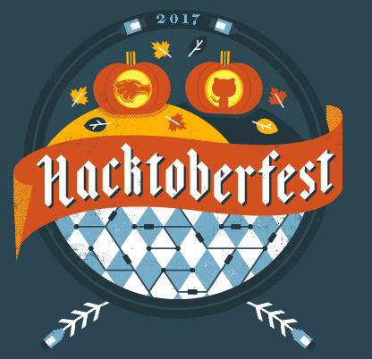

# Hacktoberfest
<p align="center">

</p>
[Hacktoberfest Checker Site](https://hacktoberfestchecker.herokuapp.com/)

Hacktoberfest Allen Texas Census. Easy to Do! . https://AllenCompSci.github.io/Hacktoberfest

A census of those participating in Hacktoberfest 2017 (and an easy PR!)
* https://github.com/Cutwell/Hacktoberfest-Census (Census concept and original build sourced from Cutwell)
* https://github.com/Nguyen17/Hacktoberfest-Sign-In (Sign-In concept and original build sourced from Nguyen17)
## Many thanks for concepts, builds and ideas.

This census has a live webpage [here](https://allencompsci.github.io/Hacktoberfest), it's automatically updated every time a PR is accepted!

---

---

### Contributing
Fork this project and add your username + profile link to the [Census](https://github.com/AllenCompSci/Hacktoberfest) list below, then make a Pull Request to add your name to this repository like so..
```markdown
[AllenCompSci](https://github.com/AllenCompSci)
```

### Census
 - [AllenCompSci](https://github.com/AllenCompSci)
 - []()
 
